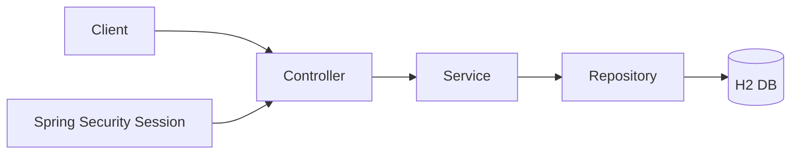

# Personal Finance Manager

REST API for tracking income, expenses, savings goals, and simple reports — built with **Spring Boot 3** and **session-based login** as required by the assignment brief.

> **Live demo:** replace with your Render URL after deploy  
> `https://YOUR-APP.onrender.com/api`

---

## Quick start (Windows)

**Prerequisites:** Java 17

```powershell
winget install EclipseAdoptium.Temurin.17.JDK
```

```powershell
cd path\to\syfe_project
.\scripts\verify-local.ps1          # unit tests
.\mvnw.cmd spring-boot:run          # API on http://localhost:8080/api
```

**E2E script** (Git Bash, while the app is running):

```bash
bash financial_manager_tests.sh http://localhost:8080/api
```

Target: **86 / 86** passed.

Open `http://localhost:8080/api/` to see a public page with all API routes and methods.


Why things are built this way → [DESIGN.md](DESIGN.md)

---

## What this project does

| Feature | Endpoints |
|---------|-----------|
| Register / login / logout | `/auth/*` |
| Transactions (CRUD + filters) | `/transactions` |
| Default + custom categories | `/categories` |
| Savings goals + progress | `/goals` |
| Monthly & yearly reports | `/reports/*` |

Default categories seeded on signup:

- **INCOME:** Salary  
- **EXPENSE:** Food, Rent, Transportation, Entertainment, Healthcare, Utilities  

---

## Architecture (high level)



- **Controllers** — HTTP, validation, status codes  
- **Services** — business rules (dates, goal math, user isolation)  
- **Repositories** — JPA  
- **DTOs** — API JSON separate from database entities  
- **GlobalExceptionHandler** — consistent `{ "message": "..." }` errors  

---

## Tech stack

| | |
|--|--|
| Java 17 | Spring Boot 3.2 |
| Spring Security | Session cookie (`JSESSIONID`) |
| Spring Data JPA | H2 in-memory |
| JUnit 5 + Mockito | JaCoCo (80%+ on service layer) |
| Maven | Docker (Render deploy only) |

---

## Example session (curl)

```bash
# Register
curl -s -X POST http://localhost:8080/api/auth/register \
  -H "Content-Type: application/json" \
  -d '{"username":"me@example.com","password":"password123","fullName":"Alex","phoneNumber":"+1234567890"}'

# Login (saves cookie)
curl -s -c cookies.txt -X POST http://localhost:8080/api/auth/login \
  -H "Content-Type: application/json" \
  -d '{"username":"me@example.com","password":"password123"}'

# List categories
curl -s -b cookies.txt http://localhost:8080/api/categories

# Add salary
curl -s -b cookies.txt -X POST http://localhost:8080/api/transactions \
  -H "Content-Type: application/json" \
  -d '{"amount":5000,"date":"2024-01-15","category":"Salary","description":"Pay"}'
```

---

## Testing

```bash
# Unit + integration tests
./mvnw test

# Coverage report
./mvnw test jacoco:report
# open target/site/jacoco/index.html
```

Includes:

- Service unit tests (mocked repositories)  
- `AuthControllerIntegrationTest` — register + session  
- `FinanceWorkflowIntegrationTest` — income/expense/goal/report flow  

---

## Configuration

| File | Purpose |
|------|---------|
| `application.properties` | Port, context path `/api`, H2 |
| `Dockerfile` | Render production build |
| `render.yaml` | Render health check hint |

---

## HTTP status codes

| Code | When |
|------|------|
| 201 | Created (register, transaction, category, goal) |
| 400 | Validation / bad input |
| 401 | Not logged in or wrong password |
| 403 | e.g. deleting a default category |
| 404 | Resource not found (or another user’s data) |
| 409 | Duplicate email or category name |

Errors return JSON: `{ "message": "clear description" }`.

---

## Notes for reviewers

1. **E2E script** in repo root is the official `financial_manager_tests.sh` (86 scenarios).  
2. **Goal progress** = net income since `startDate`, per goal.  
3. **Deleted transactions** are soft-deleted and excluded from goals/reports.  
4. **Transaction date** cannot be changed after creation (update body may send `date`; it is ignored).  

---

## Author

Built as the Personal Finance Manager assignment submission.
